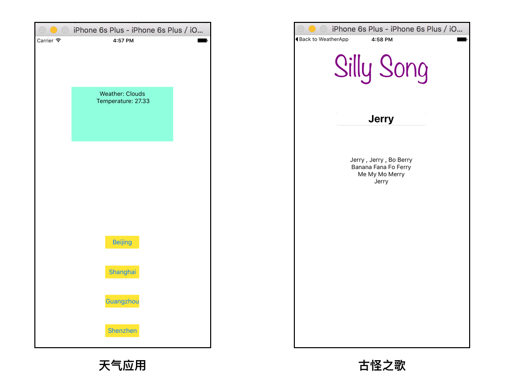
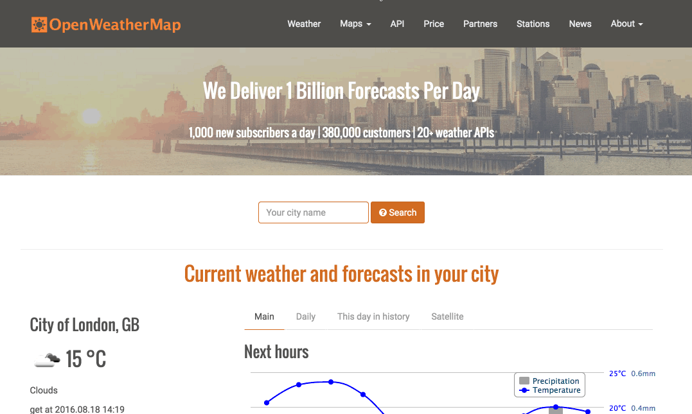
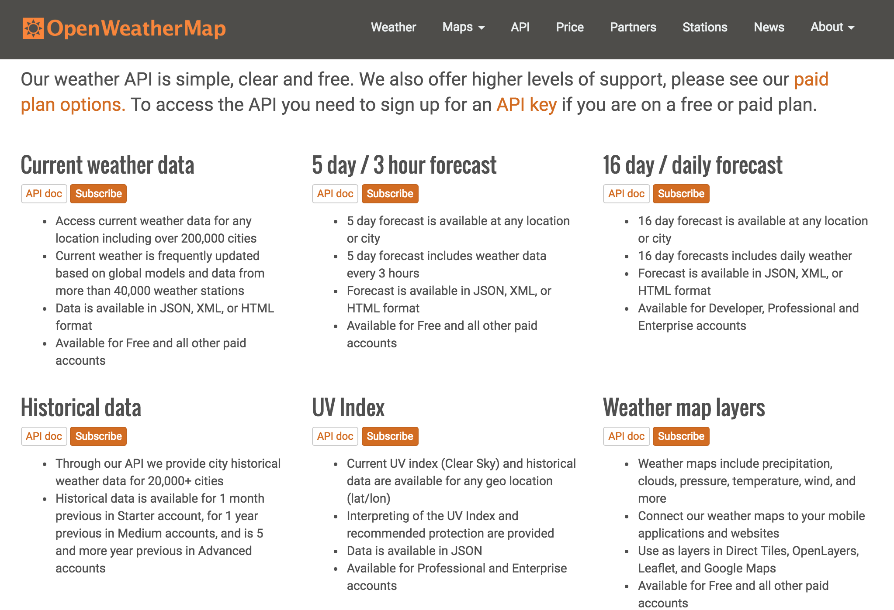
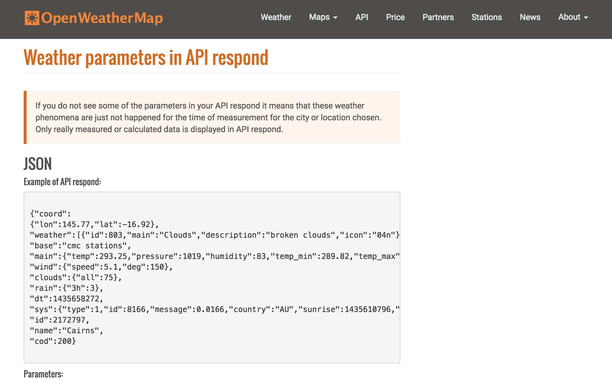
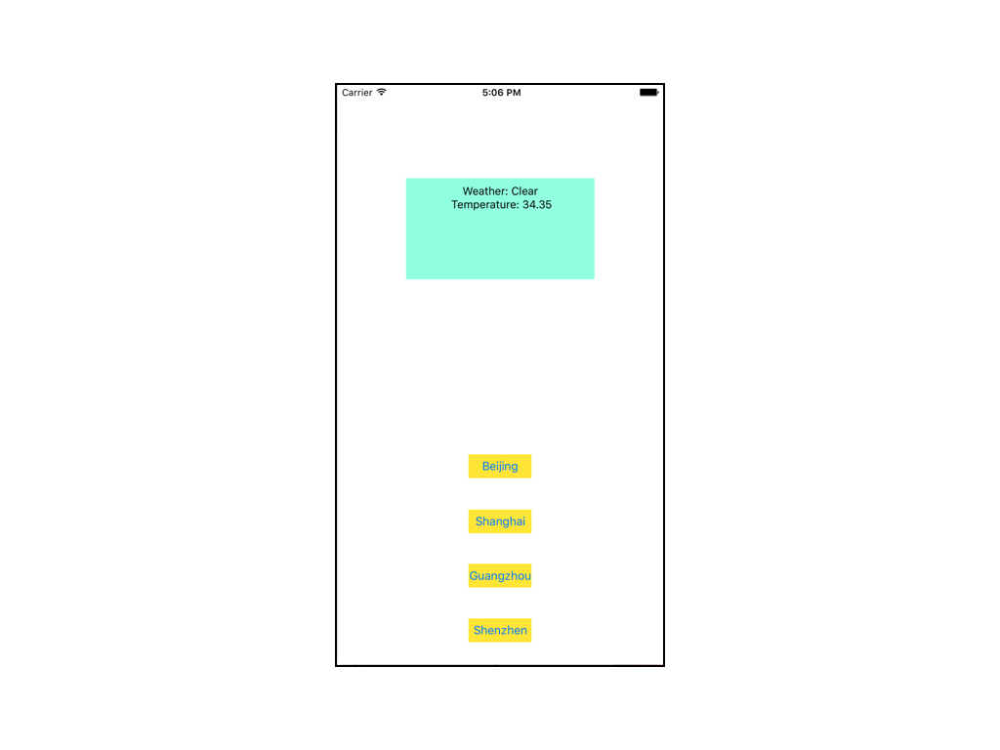
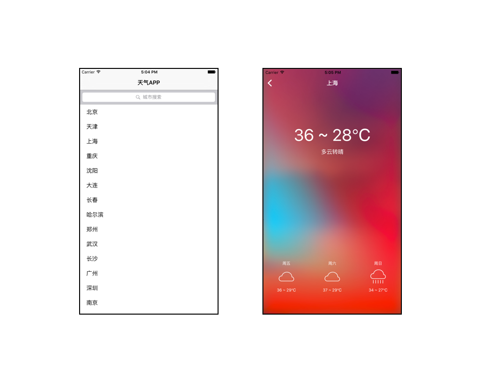

# iOS应用开发入门 纳米学位
## 滴滴实习生项目：开发你自己的天气应用
### 前言
欢迎选修滴滴实习生项目，来到这里说明你已经顺利完成了 iOS应用开发入门 纳米学位的前8个项目。在这个过程中，你通过学到的知识帮助我们添加了水雷，提升了 **海盗舰队** 的可玩性；编写更加智能的判断逻辑，帮助机器人顺利走出 **机器人迷宫** ；基于你对 Swift 的熟练掌握，你又帮助机器人一次又一次地化解 **外星人** 的难题；并在之后第一次展现你从0到1的应用开发技能，将课程所有的知识整合在一起，创造出了简单但很有趣的 **古怪之歌** 游戏。走到这里，你应该为自己感到骄傲，你踏上了这条缤纷多彩的编程之路，希望开发出更加好玩好用的应用，让世界变得更加有趣和美好！

我们为你喝彩，为你所取得的成绩倍感骄傲！我们深知你所取得的这些成绩来之不易，也相信你并不会停止于此，而是会继续向前，克服一个又一个难题，使自己变得更为出色。而在这个过程中，我们——优达学城——依然是你最好的伙伴，帮助，引导，鼓励，见证你的成功，是我们最大的成功！

我们坚信，项目是知识学习和证明自己最好的方式，也是我们构建纳米学位的核心基础。在此，作为 **iOS应用开发入门** 的毕业生，我们再次向你发出邀请，开启新的征程，完成天气应用，向滴滴证明你的能力！

## 知天气：最有特色的天气应用
### 项目概述
本项目分为三种难度，建议学生根据自己的实际情况选择不同难度的项目版本开发。对于绝大部分学生，我们建议你从 **基础版** 开始制作。若你对后面两个版本同样有兴趣，建议你在 **基础版** 的基础上不断迭代更新。

#### 基础版：

* 通过自建 UI Button 列出中国主要热门城市，用于选定某个城市查看当天天气；
* 根据选择的城市，拉取天气数据。数据可从 free weather api 获取；
* 基于天气数据显示，至少包括：当天天气状况（晴、多云……）和温度；

#### 中级版：

* 通过 **Table View** 列出中国主要热门城市，用于选定某个城市查看天气；
* 根据选择的城市，拉取天气数据。数据可从 free weather api 获取；
* 基于天气数据显示，至少包括：当天及 **未来3天** 的天气状况（晴、多云……）和温度；

#### 高级版：

* 通过 **Table View** 列出中国主要热门城市，用于选定某个城市查看天气；**同时提供搜索框（汉字或拼音）输入城市信息**；
* 根据选择的城市，拉取天气数据。数据可从 free weather api 获取；
* 图形显示天气数据显示，至少包括：当天及 **未来3天** 的天气状况（晴、多云……）和温度；
* **下拉拖动手势自动刷新**
* **自动定位并显示天气数据**

### 开始

在完成整个项目的过程中，你可能需要发挥在 iOS应用开发入门 课程中所训练的信息检索和自学能力，以实现自己心目中的知天气所应具备的功能。在这个过程中，我们将会简单地带领你完成基础版知天气，在此基础上，欢迎你展现你的想象力，实现更酷更炫的功能，并满足中级版和高级版的应用要求。

#### 从 古怪之歌 到 知天气
在 iOS应用开发入门 的第8个项目中，我们通过使用 IBOutlet 和 IBAction 来构建我们的 古怪之歌 应用，通过输入名字来自动生成一首古怪之歌。

* 通过 IBOutlet 来改变UI属性（如 TextView 中的文字）
* 通过 IBAction 来调用函数执行特定的指令

而我们基础版的 知天气 和 古怪之歌 在用户界面上有很大的相似之处。在 知天气 中，我们通过点击不同的 UIButton 来获取指定城市的天气信息。

用户界面相似点：

* 适当的位置限制确保用户界面中的元素处于正确的位置
* 通过 TextView 展现所需信息

用户界面不同点：

* 知天气 通过 IBButton 调用函数；古怪之歌 通过回车调用函数

#### 通过 API 获取数据

在古怪之歌中，我们的歌曲模版存储在应用程序内部本身；而在知天气中，我们并没有办法预知未来的天气并将其存储在程序中（预知未来可没有那么容易：P）。因此，我们需要通过其它手段从外部来获得天气信息，在这里我们将介绍最为常用的获取方式：API接口调用。

[API](https://zh.wikipedia.org/wiki/%E5%BA%94%E7%94%A8%E7%A8%8B%E5%BA%8F%E6%8E%A5%E5%8F%A3)(Application Programming Interface) 又称为应用编程接口，只要程序满足一定的“交流方法”约定，你就可以实现程序间的内容传输（包括我们的天气！）

根据你的实际情况，你可以选择选修 优达学城 的免费课程“iOS Networking with Swift”课程的第一节课“[Making a Network Request](https://classroom.udacity.com/courses/ud421/lessons/6563524813/concepts/37506287980923#)”，以学习所需要的 API 接口调用技能。

#### 了解 OpenWeatherMap 的 API

当前互联网上有很多免费的天气 API 可以申请和使用，这里我们推荐使用 [OpenWeatherMap](http://openweathermap.org/)。打开链接并将网页下拉并找到 “Try Free APIs” 并点击进入。

点击进入后，你将可以看到 OpenWeatherMap 所提供的不同解决方案。我们将会用到的有：

* Current weather data: 获取当前天气信息，支持你完成基础版知天气
* 5 day / 3 hour forecast: 获取5天的天气信息，支持你完成中级版和高级版知天气

此处我们以 Current weather data 为例。点击 Current weather data 下方的 [API doc](http://openweathermap.org/current)，你将可以看到 OpenWeatherMap 的 API 可以通过不同的方式调用：

* 通过城市名称：api.openweathermap.org/data/2.5/weather?q=London&APPID=YOUR\_API_KEY
* 通过城市ID：api.openweathermap.org/data/2.5/weather?id=2172797&APPID=YOUR\_API_KEY
* 通过地理坐标：api.openweathermap.org/data/2.5/weather?lat=35&lon=139&APPID=YOUR\_API_KEY
* 通过邮编地址：api.openweathermap.org/data/2.5/weather?zip=94040,us&APPID=YOUR\_API_KEY

现在你面临 App 开发的第一个选择：你究竟应该选择哪种方式来调用 API？注意，没有绝对的正确或错误，但你应该从开发便利性的角度去思考适合的方式。

确定了 API 的调用方式之后，我们再来看一下通过调用所返回的 JSON 结构。下拉页面至 “Weather parameters in API respond” 处，你将可以看到所返回的 JSON 中所有的参数及其含义。

现在你面临 App 开发的第二个选择：返回的 JSON 文件中，哪些是你需要展现在 App 中的？注意，这里同样没有绝对的正确或错误，但天气信息一般都会包含温度及天气情况。

#### 申请 OpenWeatherMap API

至此你已经大体了解了 OpenWeatherMap 的 API 使用方法，还记得之前 URL 调用中的 YOUR\_API_KEY吗？这个就是你独有的密钥，只有拥有密钥之后，你才能调用 OpenWeatherMap 的 API。

在 [API 选项页面](http://openweathermap.org/api) 的 Current weather data 下点击 subscribe ，你将可以看到不同的 API KEY 套餐，对于我们的应用来说，免费版是很好的开始：）

点击免费版下的 “Get API Key and Start”，并按要求注册，之后你就可以获得属于你自己的 API KEY！

#### 动手写你自己的知天气

至此你已经具备了简单的知天气所需要的相关技能，在正式开始之前，我们建议你花一分钟时间阅读以下注意事项，了解你的项目所需达到的要求：

* 至少包含4个城市的天气查询选项：北京、上海、广州、深圳（中高级应支持更多）
* API 推荐使用 OpenWeatherMap 的免费接口；若使用其它 API ，需在代码中添加额外的注释解释
* 用户界面不必与示例完全一致，但必须包含 TextView 和 4 个 UIButton 获取对应城市天气信息
* 首选推荐使用 Swift 内置的 API和JSON 库（NSURLSession，NSJSONSerialization）；若使用第三方库，请注明所使用的三方库名称以及相关注释
* 若有参考其它项目的代码片段，请注明相关代码出处

这个知天气的设计完全由你决定！以下是我们的两份参考界面（初级及中高级）。

不过，你不必局限于示例的界面，发挥想象，激发创意，把你的所学全都展现在这个应用中吧！

 # Archival Note 
 This repository is deprecated; therefore, we are going to archive it. However, learners will be able to fork it to their personal Github account but cannot submit PRs to this repository. If you have any issues or suggestions to make, feel free to: 
- Utilize the https://knowledge.udacity.com/ forum to seek help on content-specific issues. 
- Submit a support ticket along with the link to your forked repository if (learners are) blocked for other reasons. Here are the links for the [retail consumers](https://udacity.zendesk.com/hc/en-us/requests/new) and [enterprise learners](https://udacityenterprise.zendesk.com/hc/en-us/requests/new?ticket_form_id=360000279131).